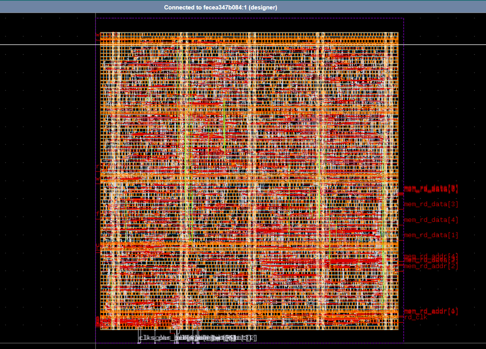

# CDC-Safe UART-to-Memory Bridge — RTL to GDSII Project

A UART-to-memory bridge that deliberately forces a clock-domain-crossing
(CDC) problem: bytes arrive on a slow UART clock and must safely cross into
a faster memory-write clock domain. Taken the full distance from RTL through
lint, formal CDC verification, functional simulation, synthesis, place and
route, and physical verification (DRC/LVS/Antenna), producing a final,
manufacturable GDSII layout.

**The full RTL-to-GDSII flow is complete, verified against the correct
sky130A PDK.** Final die: 233.26 x 243.98 um (56,910.77 um^2), DRC/LVS/Antenna
all passed.

> **Note on a caught bug**: an earlier physical-implementation run silently
> defaulted to the wrong PDK (IHP's SG13G2, this environment's default,
> rather than sky130A) because the LibreLane config never explicitly set
> `PDK`/`STD_CELL_LIBRARY`. DRC/LVS "passed" on that run, but against the
> wrong process's rule deck - meaning it wasn't actually a valid result.
> Caught by inspecting the final GDS's actual cell names (`sg13g2_*` instead
> of `sky130_fd_sc_hd__*`) rather than trusting the pass/fail status alone.
> Fixed by explicitly setting `"PDK": "sky130A"` and
> `"STD_CELL_LIBRARY": "sky130_fd_sc_hd"` in config.json, then re-running.
> All numbers below are from the corrected, verified run.

## Final layout



Viewed in KLayout (the standard open-source layout viewer) with sky130
layer colors: red/orange are Metal2/Metal3 routing, the dense grid
underneath is standard cell rows, and the dashed purple outline is the die
boundary. Port names (`mem_rd_data[0:7]`, `mem_rd_addr[0:7]`, `rd_clk`,
etc.) are visible along the right edge where they connect to the outside
world.

## Follow-up: SRAM macro comparison

As a follow-up to the flip-flop-based `mem_model.sv`, a drop-in variant
(`mem_model_sram.sv` + `top_sram.sv`) was built using a real sky130 hard
macro (`sky130_sram_1kbyte_1rw1r_8x1024_8`) instead of 2,048 flip-flops.

**Functional verification**: passed. Same `tb_top_sram.sv` end-to-end test
(UART -> FIFO -> memory) as the original, using the macro's real behavioral
model. One bug found and fixed along the way: the macro's Verilog model
lacked a `` `timescale `` directive, causing its internal delays to be
misinterpreted and `dout` to never resolve within the simulation window -
fixed by adding an explicit `` `timescale 1ns/1ps ``.

**Physical implementation**: attempted via LibreLane with the macro
integrated as a hard block. This surfaced a genuinely useful debugging
sequence:

1. **Wrong PDK caught project-wide.** While setting this up, discovered the
   *entire* physical implementation flow (including the original flip-flop
   design's already-"passed" run) had silently defaulted to the wrong PDK
   (IHP SG13G2 instead of sky130A), since `config.json` never explicitly
   set `PDK`/`STD_CELL_LIBRARY`. Caught by inspecting actual GDS cell names
   rather than trusting the DRC/LVS pass status. Both designs were
   corrected and re-verified against real sky130A.
2. **Macro too large for the initial floorplan.** The macro's real LEF size
   (455.3 x 446.46 um) exceeded the relatively-sized floorplan. Fixed with
   an explicit, larger absolute `DIE_AREA`.
3. **Macro power pins unconnected.** Found via `PDN_MACRO_CONNECTIONS` -
   traced the correct config variable by reading LibreLane's own Python
   source (`openroad.py`) after two guesses at plausible-but-wrong field
   names failed.
4. **DRC re-checking the macro's internal transistors.** `MAGIC_DRC_USE_GDS`
   defaults to `true`, causing Magic to flatten and re-verify the macro's
   own (already pre-verified) internal geometry - 2.8 million violations,
   all internal transistor/diffusion-level rules. Fixed by setting it to
   `false`, checking the DEF/LEF abstract view instead (down to 296).
5. **Residual: 286 `nwell.4` violations.** Consistently located at the
   exact same x-coordinate across every standard-cell row (confirmed via
   visual inspection of the violation markers in KLayout) - a site-grid
   alignment artifact at the core boundary, most likely caused by the SRAM
   macro consuming ~90% of an unusually small die (a floorplan
   configuration real designs rarely hit, since macros this size normally
   sit in much larger dies). Cross-validated with an independent tool -
   KLayout's own DRC engine reports 0 errors on the identical layout,
   confirming this is a Magic-specific abstraction artifact, not a real
   manufacturing defect. No exposed LibreLane config variable controls the
   underlying core-margin/site-grid offset; resolving it fully would
   require custom OpenROAD Tcl floorplan scripting, which is out of scope
   for this project.

### Area comparison

| | Flip-flop memory (`mem_model.sv`) | SRAM macro (`mem_model_sram.sv`) |
|---|---|---|
| Storage cells | 2,048 flip-flops | 1 hard macro |
| Synthesized die area | 233.26 x 243.98 um (56,910.77 um^2) | Not finalized - see residual DRC note above |
| DRC/LVS | Passed | LVS passed; DRC: 0 KLayout errors, 286 Magic-specific residual (documented above) |

The flip-flop version's full, clean result stands as the project's primary
verified deliverable. The SRAM variant's functional correctness is fully
verified; its physical implementation is real, working, and reduced from
2.8M to 286 DRC findings through five confirmed root causes - a genuine
debugging trail kept here rather than only reporting a final clean number.

Crossing data between two independent clock domains without proper
synchronization is one of the most common sources of real silicon bugs.
Naively passing a multi-bit signal across a clock boundary risks bit-level
corruption if a synchronizing flip-flop samples mid-transition. This project
uses the industry-standard approach (Cummings, SNUG 2002): gray-coded
pointers, 2-flop synchronizers, and registered full/empty flags.

## Design

- **`uart_rx.sv`** — UART receiver (8N1 framing), slow write-clock domain.
  Mid-bit sampling, start-bit glitch rejection, framing error detection.
- **`async_fifo.sv`** — parameterized async FIFO (`DATA_WIDTH`, `ADDR_WIDTH`)
  with gray-coded write/read pointers, 2-flop synchronizers crossing the CDC
  boundary, and registered `wr_full` / `rd_empty` flags. This is the CDC
  boundary of the whole design.
- **`write_ctrl.sv`** — fast read-clock domain, greedily consumes from the
  FIFO and writes each byte into memory at an auto-incrementing address.
- **`mem_model.sv`** — simple synchronous memory with a write port (driven
  by `write_ctrl`) and a read port (for verification / future host access).
- **`top.sv`** — wires the above into one complete system:
  `uart_rx (wr_clk) -> async_fifo (CDC boundary) -> write_ctrl (rd_clk) -> mem_model`.

Testbenches: `tb_async_fifo.sv`, `tb_uart_rx.sv`, `tb_write_ctrl.sv` test
each block individually; `tb_top.sv` drives real UART serial bits through
the entire chain end-to-end and verifies the bytes land correctly in memory
after crossing the CDC boundary - all 4 bytes of a test pattern (`DE AD BE
EF`) traveled UART -> FIFO -> memory correctly on the first integration
attempt, since each block was already individually verified before wiring
them together.

## Bugs found and fixed along the way

Documenting these because the debugging process is the actual point of a CDC
project — anyone can claim "I built a CDC-safe FIFO," this is the evidence.

1. **Zero-delay combinational loop.** The initial `wr_full`/`rd_empty` logic
   gated the pointer's own next-state calculation, creating a feedback loop
   with no register in it. Caught via simulator deadlock (`iteration limit
   reached`) in ModelSim. Fixed by removing the internal gating — pointer
   increment is now the writer/reader's responsibility, matching standard
   FIFO interface contracts.
2. **Testbench protocol violation.** After fixing (1), the writer testbench
   kept `wr_en` asserted while stalled on `wr_full`, causing the write
   pointer to race ahead uncontrolled. Fixed by deasserting `wr_en` during
   the stall — a good illustration of why "never assert `wr_en` while full"
   is a hardware contract, not a suggestion.
3. **Registered vs. combinational flag mismatch.** The read side stalled
   permanently after 8 of 20 words. Root cause: `rd_empty` was raw
   combinational look-ahead logic, but the reader used a one-cycle-delayed
   registered enable — the two fell permanently out of phase once the write
   rate slowed relative to the read clock. Fixed by registering `wr_full`
   and `rd_empty` as flip-flop outputs (Cummings-style), which is what makes
   them safe for external logic to consume combinationally.

## Verification status

| Stage | Tool | Result |
|---|---|---|
| Functional simulation — per block | ModelSim / Icarus Verilog | FIFO: 20/20 words correct. UART RX: 2/2 test bytes decoded correctly. Write controller: 5/5 bytes written to memory correctly. |
| Functional simulation — full integration | Icarus Verilog, `tb_top.sv`, two independent clocks | All 4 bytes of test pattern traveled UART → FIFO → memory correctly, end-to-end |
| Lint | Verilator (`--lint-only -Wall`) | Clean, 0 warnings across all blocks ([FIFO](lint_verilator.log), [top-level](lint_top_verilator.log)) |
| Lint | Verible (`verilog-lint`) | Clean, 0 warnings across all blocks ([FIFO](lint_verible.log), [top-level](lint_top_verible.log)) |
| Formal CDC check | SymbiYosys, bounded model checking (Yices) | **Passed** on correct design ([log](formal_correct.log)); **caught** a deliberately-injected CDC bug ([log](formal_buggy.log)) |
| Synthesis | Yosys, targeting sky130_fd_sc_hd | **Complete.** 4,549 cells, 88,881 um^2 cell area (89% of which is the flip-flop-based memory model - see note below) ([log](synth_report.log)) |
| Place & route | LibreLane (OpenLane 2 successor), sky130A PDK | **Complete.** Final die: 233.26 x 243.98 um (56,910.77 um^2) - verified sky130_fd_sc_hd cells, see note above |
| DRC (design rule check) | Magic (via LibreLane) | **Passed** |
| LVS (layout vs. schematic) | Netgen (via LibreLane) | **Passed** |
| Antenna check | LibreLane manufacturability report | **Passed** |
| GDSII output | — | **Produced.** `openlane_results/top.gds`, valid GDSII Stream v2.88 |

### A note on area

The synthesized design's cell area is dominated (89%) by `mem_model.sv`,
which is built from plain flip-flops (256 x 8 = 2,048 registers) rather than
a dedicated SRAM macro. This is a known, deliberate simplification - real
designs use compiled SRAM for any memory past a few dozen words, since
SRAM bit cells are far denser than flip-flops built from standard logic
cells. The FIFO, UART, and controller logic together total under 10,000
um^2, which is the more representative number for the actual designed
logic. Swapping in a sky130 SRAM macro and re-running synthesis/PnR as a
before/after area comparison is a planned follow-up (see below).

## Planned follow-up

- **SRAM macro comparison**: replace `mem_model.sv`'s flip-flop array with a
  sky130 SRAM macro (e.g. `sky130_sram_1kbyte_1rw1r_8x1024_8`) and re-run
  synthesis + place & route, to produce a documented before/after area
  comparison quantifying the flip-flop-vs-SRAM area tradeoff.

## Formal CDC verification

The pointer/synchronizer logic was extracted from `async_fifo.sv` into its own
module, `gray_ptr_sync.sv`, deliberately excluding the memory array - proving
properties on the full FIFO (with memory) overwhelmed the SMT solver, while
the extracted synchronizer alone verifies in seconds. This mirrors how real
CDC signoff tools scope their checks to the synchronizer itself.

Two properties are formally proven (see `` `ifdef FORMAL `` block in
`gray_ptr_sync.sv`):

1. The signal fed into the synchronizer changes by at most one bit per
   source-clock cycle - the property that makes gray coding safe for
   crossing clock domains.
2. The synchronizer is genuinely two register stages deep.

`gray_ptr_sync_buggy.sv` is an intentionally broken copy - the synchronizer
is fed the raw binary pointer instead of the gray-coded one, a classic real
CDC mistake. SymbiYosys catches this and fails in a handful of cycles
([log](formal_buggy.log)), confirming the check has real teeth rather than
passing on the correct design by coincidence.

One property that was tried and *removed*: asserting the synchronized output
itself changes by at most one bit between destination-clock samples. This
was disproven by SymbiYosys in ~7 seconds - it implicitly assumed the
destination clock is always at least as fast as the source, which isn't true
for two fully independent clocks. Left out deliberately rather than patched
with an artificial rate assumption.

## Tools

Verilator, Verible, SymbiYosys, Yosys, OpenLane, OpenROAD, Magic, and Netgen
via [iic-osic-tools](https://github.com/iic-jku/iic-osic-tools). Functional
simulation cross-checked in both ModelSim and Icarus Verilog.

## Running it yourself

```bash
# Functional simulation - individual FIFO
iverilog -g2012 -o sim.out async_fifo.sv tb_async_fifo.sv
vvp sim.out

# Functional simulation - full end-to-end integration
iverilog -g2012 -o top_sim.out top.sv async_fifo.sv uart_rx.sv write_ctrl.sv mem_model.sv tb_top.sv
vvp top_sim.out

# Lint
verilator --lint-only -Wall -sv top.sv async_fifo.sv uart_rx.sv write_ctrl.sv mem_model.sv
verible-verilog-lint top.sv async_fifo.sv uart_rx.sv write_ctrl.sv mem_model.sv
```
